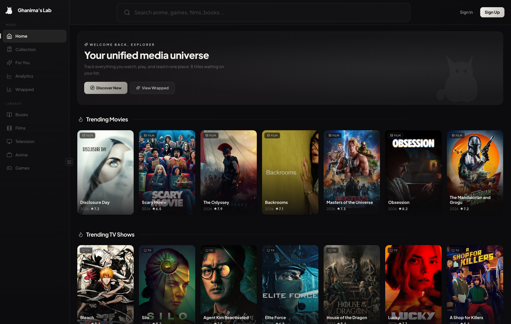
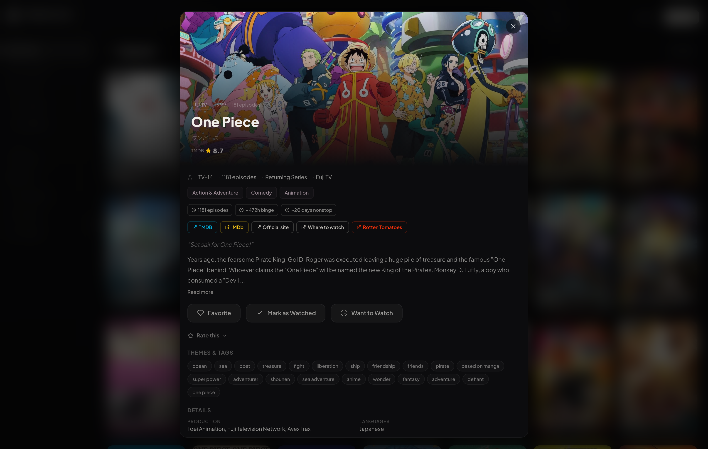
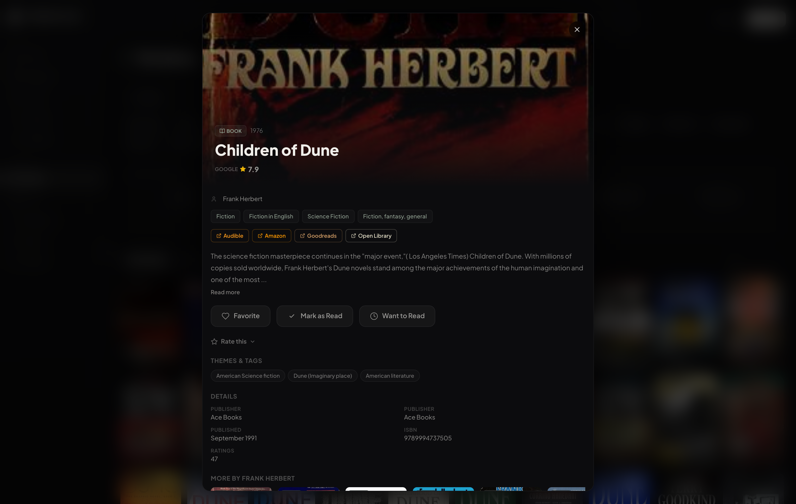
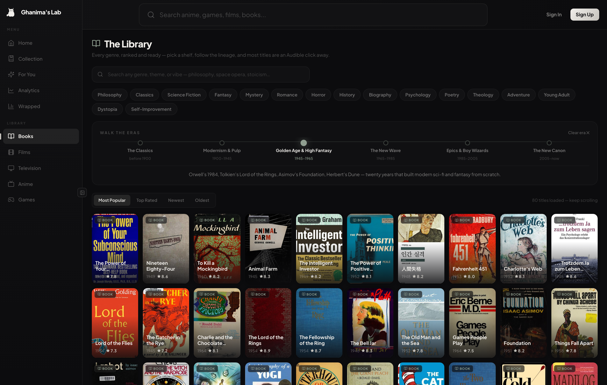
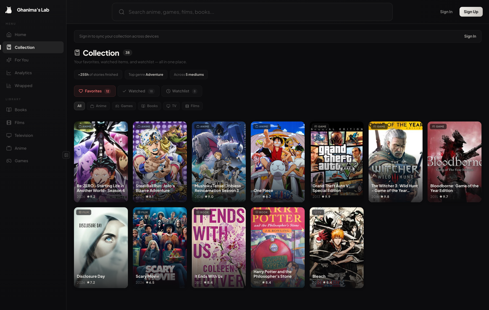
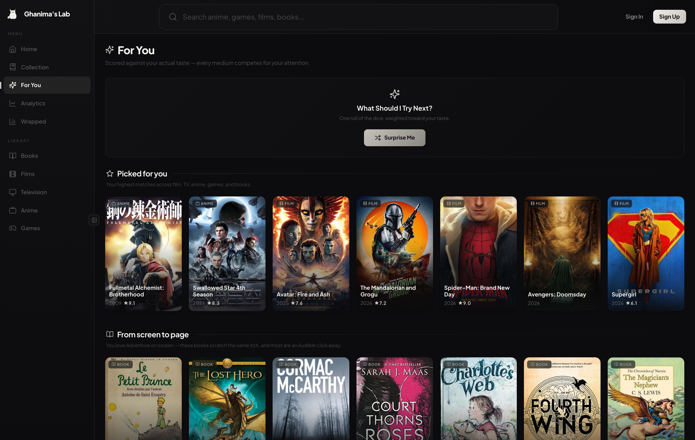
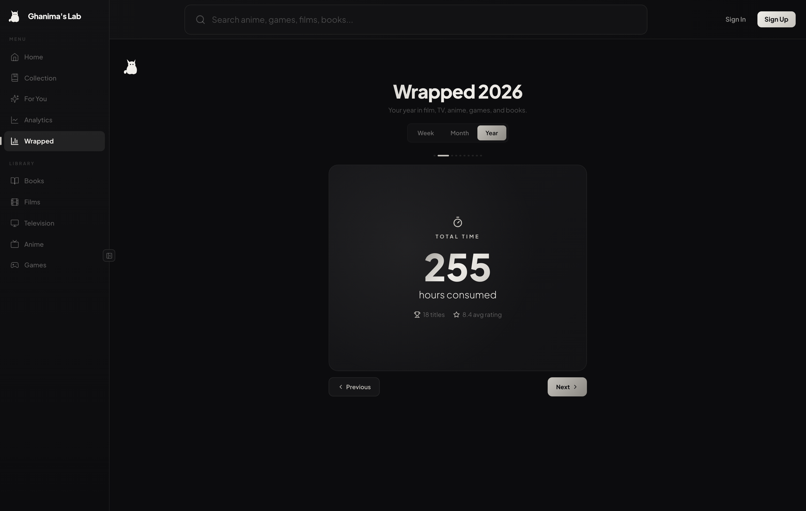
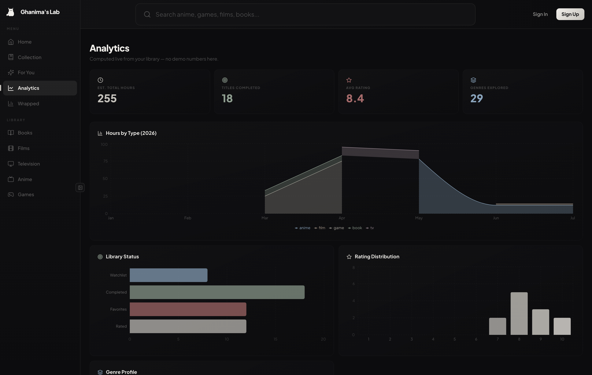
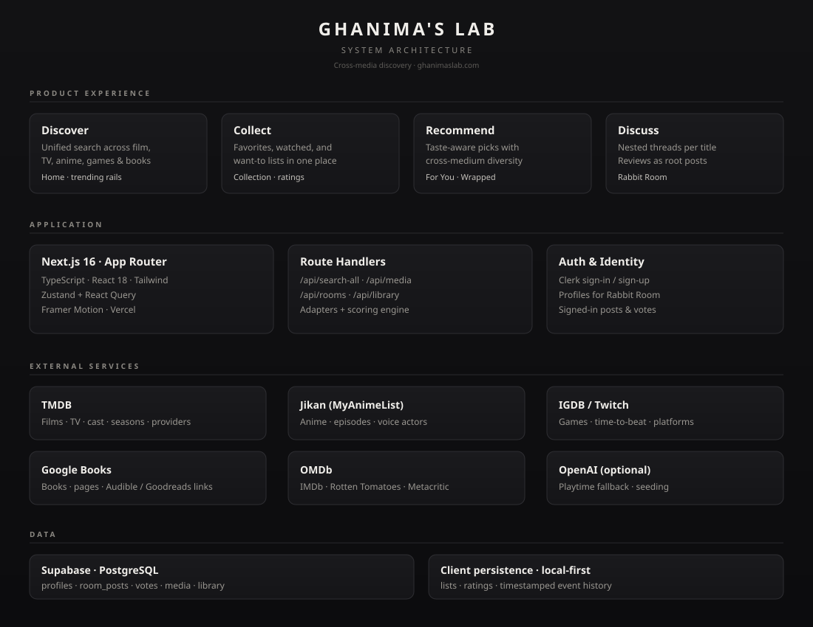
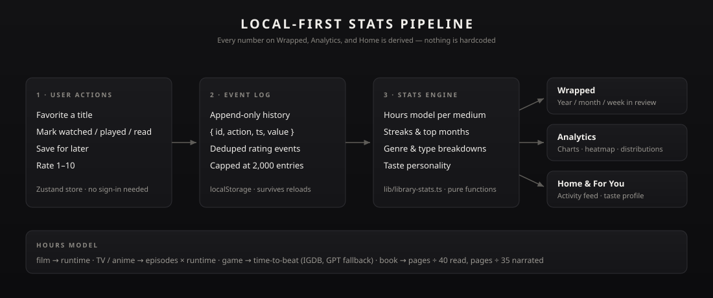

<p align="center">
  
</p>

<h1 align="center">Ghanima's Lab</h1>

<p align="center">
  <strong>A unified library for films, TV, anime, games, and books.</strong><br/>
  Discover across sources, collect what you love, get taste-aware recommendations,<br/>
  and discuss titles in the Rabbit Room.
</p>

<p align="center">
  <a href="https://ghanima.io">Live site</a>
  ·
  <a href="#why">Why</a>
  ·
  <a href="#product-tour">Product tour</a>
  ·
  <a href="#architecture">Architecture</a>
  ·
  <a href="#how-the-stats-engine-works">Stats engine</a>
  ·
  <a href="#quick-start">Quick start</a>
  ·
  <a href="#roadmap">Roadmap</a>
</p>

<p align="center">
  
  
  
  
  
</p>

---

## Why

Most people don't consume media in one silo. You finish a film, start the novel it was based on, then drop into a related game — but the tools for tracking taste stay fragmented: Letterboxd for films, MyAnimeList for anime, Goodreads for books, Steam for games.

**Ghanima's Lab** is a product experiment in *cross-medium continuity*: one library, one search surface, one recommendation loop, and structured discussion around each title. The thesis is simple — if the system understands your taste in one medium, it can lead you somewhere unexpected in another. Someone who loves *The Witcher 3* and *One Piece* might be one nudge away from picking up Seneca on audiobook.

A second principle: **no dead ends**. Every detail card links onward — same-franchise titles, other books by the author, DLC and sequels, fan-recommended anime, and a cross-media "Explore more" strip — so the site behaves like a continuous loop of discovery rather than a lookup tool you bounce off of.

Built end-to-end as a solo project: scoping a real problem, shipping discovery UX, identity, collections, a local-first stats engine, and community threads.

---

## Product tour

### Design goals

| Goal | How it shows up |
|------|-----------------|
| Reduce context-switching across media apps | Single search + one normalized media model |
| Search that ranks like a human expects | Popularity-weighted relevance — "dune" surfaces the Villeneuve films and the Herbert novels before shovelware with the same name |
| Make taste legible | Collection, ratings, Wrapped, Analytics |
| Recommend across mediums | For You scoring + diversity weighting + rails named after *your* favorites |
| Depth per title, JustWatch-style | Runtime, binge time, time-to-beat, read/listen estimates, external scores, cast, franchises, streaming links |
| No dead ends | Related-titles and Explore-more strips on every card keep the loop going |
| A library you can wander | Per-medium browse sections with genre pills, free-text themes, and curated era timelines |
| Feels fast, stays fast | Provider-grouped progressive loading, SWR caching, hover prefetch, hard upstream timeouts |
| Zero-friction start | Everything works anonymously; sign-in only for discussion |

### Home — unified discovery

Twenty-plus trending rails across all five mediums — each one an infinite horizontal scroll that keeps paging in fresh titles — plus a live activity feed and stats computed from your actual library (hours this week, current streak, average rating). Rails load progressively by provider, so film and TV paint in a few hundred milliseconds while slower sources stream in behind them.

<p align="center">
  
</p>

### Media detail — depth per title

Every title is enriched on open — and the enrichment is prefetched the moment you hover a card, so it feels instant:

- **Time economics** — binge time for TV and anime (real episode counts), time-to-beat for games, read time and audiobook length for books.
- **External scores** — IMDb, Rotten Tomatoes, Metacritic, MyAnimeList, Open Library ratings.
- **People and production** — cast, voice actors, studios, networks, budget and box office, game engines and perspectives.
- **Onward links** — streaming platforms for anime, Audible / Google Books for novels, official sites and stores for games.
- **Two discovery strips** — *Related titles* (same medium: franchise entries, DLC, more by the author, fan recommendations) and *Explore more* (cross-media picks that match the title's vibe).

<p align="center">
  
</p>

The same depth applies to books — page counts, reading and audiobook time, Open Library ratings, an Audible link, and a "More by this author" strip:

<p align="center">
  
</p>

### The Library — deep browse per medium

Each medium gets its own wing: a dense, infinitely-scrolling grid with genre pills, free-text theme search ("philosophy", "time travel", "soulslike"), sort controls, and an interactive **era timeline** — tap "Golden Age & High Fantasy" or "New Hollywood" and the shelf filters to that period with a one-line history of why it mattered. It's meant to work like a digital library: type "stoicism" into the book wing and walk out with an audiobook.

<p align="center">
  
</p>

### Collection — your library

Favorites, completed, and want-to lists with per-medium filters, plus a stats strip (estimated hours finished, top genre) derived from what you've tracked.

<p align="center">
  
</p>

### For You — taste-aware recommendations

A scoring engine builds a taste profile from your library (genres, mediums, ratings) and ranks every candidate against it. Rails explain themselves — and they're personal: "Because you played The Witcher 3" or "From screen to page" instead of a generic genre label. Items are deduplicated across rails so the page reads like a magazine, not an echo.

<p align="center">
  
</p>

### Wrapped — your year (or month, or week) in review

A Spotify-Wrapped-style story: total hours, top titles, genre breakdown, streaks, and a taste personality — all computed from the event history, shareable as an Open Graph card.

<p align="center">
  
</p>

### Analytics — the quantified library

Hours by medium over time, library status, rating distribution, genre radar, and a daily activity heatmap. No demo numbers — every chart reads from the same event log.

<p align="center">
  
</p>

---

## Architecture

<p align="center">
  
</p>

**Experience** — Discover, collect, recommend, discuss.
**Application** — Next.js App Router (TypeScript), Zustand + React Query, Route Handlers, Clerk auth.
**Services** — TMDB, Jikan (MyAnimeList), IGDB/Twitch, Open Library, Google Books, OMDb; optional OpenAI for playtime fallback.
**Data** — Supabase Postgres (profiles, library, Rabbit Room); local-first client persistence for lists, ratings, and event history.

### The unified media model

Every adapter normalizes its source into one `MediaItem` shape — id, type, title, cover, genres, rating, runtime — so search, collection, recommendations, and stats never care where a title came from. Enrichment (cast, scores, links, time estimates) happens lazily in `/api/media/[slug]`, prefetched on card hover so opening a title feels instant; the cross-media Explore strip loads independently from `/api/explore-more` so it never blocks the details. Responses are cached with Next.js revalidation.

### Staying fast when upstreams aren't

Six free third-party APIs means somebody is always slow or down, so the app is built to degrade instead of hang: home rails load in **provider groups** (TMDB, IGDB, Jikan, Open Library) fetched in parallel and cached server-side with stale-while-revalidate; every upstream call carries a hard `AbortSignal` timeout so one flaky source can't stall a search fan-out; and shelves that depend on a live query fall back to that provider's cached top lists during an outage (MyAnimeList goes down more often than you'd think).

### How search ranking works

`/api/search-all` queries all five sources in parallel, then scores each hit by blending **title/author match** with **log-scaled popularity per source** (TMDB votes, MAL members, IGDB rating counts, book ratings). A popular title that also matches the query dominates — which is what puts *Dune (2021)*, *Dune: Part Two*, and the Herbert novels above obscure exact-name matches. Books fall back to Open Library when Google Books is over quota, and typo-tolerant matches are ranked down instead of dropped.

### How the stats engine works

<p align="center">
  
</p>

The interesting constraint: meaningful stats **without requiring an account**.

1. **Actions become events.** Every favorite, completion, and rating appends `{ id, action, ts, value }` to an event log in localStorage (rating-slider noise is deduped, log capped at 2,000 entries).
2. **Pure functions derive metrics.** `lib/library-stats.ts` turns the log into hours (per-medium time model shown above), streaks, top months, genre profiles, and a taste personality.
3. **Three surfaces render them.** Wrapped, Analytics, and the Home dashboard all read from the same derivations — there is no second source of truth to drift.

### How recommendations work

`lib/recommendations/engine.ts` builds a taste profile (genre weights, medium affinity, rating-weighted signals) and scores every candidate item. Rails are then assembled with diversity weighting so one dominant genre doesn't flood the page, and each rail carries the reason it exists ("Because you love X"). A dedicated "From screen to page" rail deliberately routes screen-heavy taste toward books.

---

## Tech stack

| Layer | Choice |
|-------|--------|
| Framework | Next.js 16 (App Router) |
| Language | TypeScript |
| UI | React 18, Tailwind CSS, Framer Motion |
| Charts | Recharts |
| Client state | Zustand, TanStack Query |
| Auth | Clerk |
| Database | Supabase (PostgreSQL) |
| Media APIs | TMDB, Jikan (MAL), IGDB/Twitch, Open Library, Google Books, OMDb |
| Hosting | Vercel |

---

## Quick start

### Prerequisites

- Node.js 18+
- API keys for TMDB, Twitch (IGDB), Google Books, Supabase, and Clerk — all free tiers

### Setup

```bash
git clone https://github.com/JonathanDunkleberger/Ghanimas-Lab.git
cd Ghanimas-Lab
npm install
cp .env.local.example .env.local
```

Fill in `.env.local`, then:

```bash
npm run dev
```

Open [http://localhost:3000](http://localhost:3000).

### Rabbit Room schema

Run [`supabase/rabbit_room_schema.sql`](supabase/rabbit_room_schema.sql) once in the Supabase SQL Editor to create `profiles`, `room_posts`, and `room_post_votes`.

> The name honors the Rabbit Room — the back room of the Eagle and Child pub in Oxford where Tolkien, C.S. Lewis, and the Inklings met to read their drafts aloud. Every title here gets its own room for the same reason.

### Regenerating the docs screenshots

The screenshots in this README are reproducible: `scripts/capture-screens.mjs` seeds a realistic library into localStorage, drives headless Chromium, and rewrites `docs/screenshots/`.

```bash
npm run dev                                              # local target
node scripts/capture-screens.mjs
# — or shoot the live site —
SHOT_BASE=https://ghanima.io node scripts/capture-screens.mjs
```

---

## Environment

### Server-side (secret)

| Variable | Purpose |
|----------|---------|
| `TMDB_API_KEY` | Film, TV, anime |
| `TWITCH_CLIENT_ID` / `TWITCH_CLIENT_SECRET` | IGDB games |
| `GOOGLE_BOOKS_API_KEY` | Books |
| `OMDB_API_KEY` | IMDb / Rotten Tomatoes / Metacritic scores (free at omdbapi.com) |
| `OPENAI_API_KEY` | Optional: game time-to-beat fallback, embeddings / seeding |
| `SUPABASE_SERVICE_ROLE_KEY` | Server writes |
| `CLERK_SECRET_KEY` | Auth |

### Client-side (public)

| Variable | Purpose |
|----------|---------|
| `NEXT_PUBLIC_SUPABASE_URL` | Supabase URL |
| `NEXT_PUBLIC_SUPABASE_ANON_KEY` | Supabase anon key |
| `NEXT_PUBLIC_CLERK_PUBLISHABLE_KEY` | Clerk publishable key |
| `NEXT_PUBLIC_DISCORD_INVITE_URL` | Optional |

---

## Repository layout

```
Ghanimas-Lab/
├── app/                  # App Router pages + API routes
├── components/           # UI components
├── hooks/                # Data hooks
├── lib/                  # API adapters, stats engine, recommendations
│   ├── api/              # TMDB, Jikan, IGDB, Google Books, OMDb, OpenAI
│   ├── library-stats.ts  # Event log -> hours, streaks, genres, personality
│   └── recommendations/  # Taste profile + scoring engine
├── stores/               # Zustand (library, event history)
├── supabase/             # SQL schemas
├── docs/                 # Architecture diagrams + screenshots
├── public/               # Static assets
└── scripts/              # Utilities, incl. screenshot capture
```

---

## Roadmap

Shipped:

- [x] Cross-source search and trending rails
- [x] The Library — per-medium browse wings with genre pills, theme search, and curated era timelines
- [x] Infinite carousels backed by a 28-rail paged registry
- [x] Progressive home loading (provider groups + server-side SWR cache)
- [x] Outage resilience — hard upstream timeouts + cached-list fallbacks
- [x] Popularity-weighted search ranking (per-source log-scaled signals)
- [x] Open Library integration — popular book rails + quota-proof fallback
- [x] Collection, ratings, For You, Wrapped
- [x] Personalized recommendation rails ("Because you played…", "From screen to page")
- [x] Local-first stats engine (event history → Wrapped / Analytics / Home)
- [x] External scores: IMDb, Rotten Tomatoes, Metacritic, MyAnimeList
- [x] Per-title depth: binge time, time-to-beat, read/listen estimates, cast, franchises, DLC, streaming links
- [x] Related-titles + cross-media Explore strips (no dead ends)
- [x] Hover-prefetched detail panels with independent Explore loading
- [x] Clerk authentication
- [x] Rabbit Room (persisted nested discussion)
- [x] Silver visual system

Next:

- [ ] Public profiles with post history
- [ ] Standalone Rabbit Room index
- [ ] Moderation / report flows
- [ ] Recommendation evaluation hooks
- [ ] Imports (Letterboxd / MAL / Goodreads)
- [ ] Accessibility & performance pass
- [ ] Custom domain aligned to product name

---

## Design principles

1. **One composition for discovery** — Home should feel like a media universe, not a dashboard dump.
2. **Identity when it matters** — Browsing is open; discourse requires an account.
3. **Cross-medium first** — Recommendations should travel across formats, especially toward books.
4. **Derived, never hardcoded** — If a number appears on screen, it's computed from real user data.
5. **Quiet visual language** — Cool silver / pearl accents on charcoal; restraint over spectacle.

---

## Attribution

- Film / TV via [TMDB](https://www.themoviedb.org/) (not endorsed or certified by TMDB)
- Anime via [Jikan](https://jikan.moe/) / [MyAnimeList](https://myanimelist.net/)
- Games via [IGDB](https://www.igdb.com/) / Twitch API
- Books via [Open Library](https://openlibrary.org/) and [Google Books](https://developers.google.com/books)
- Ratings via [OMDb](https://www.omdbapi.com/)
- Logos and trademarks belong to their respective owners

---

## License

MIT — see [`LICENSE`](LICENSE).

---

<p align="center">
  <sub>Jonathan Dunkleberger · Product case study · <a href="https://ghanima.io">ghanima.io</a></sub>
</p>
